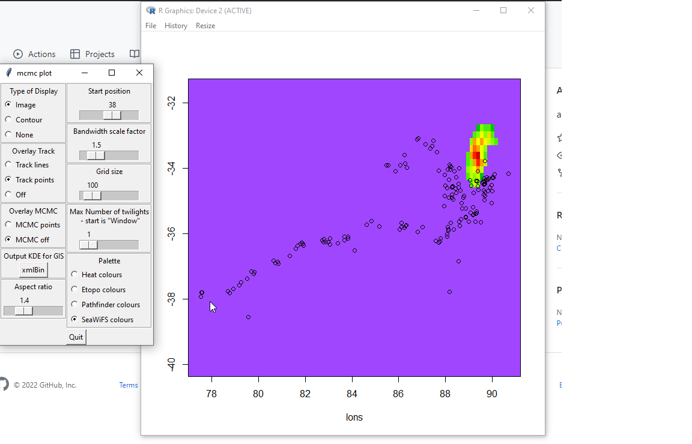

# extcltk
an old tcltk app in R

# To run it

This loads the code in 'sMat.R', reads a csv, and an old MCMC binned array thing, and provides a tcltk interative app. 


```R
source("extent.r")
```

## What is it doing?

This provides a little tcltk GUI, and an open R graphics plot. you can see the plot update as you change the settings. 

Try playing with **Start position** and **Max number of twilights**. Some settings affect performance, like **Gridsize** and **Bandwidth scale factor**.  Use **Aspect ratio** ~ 1.2 to get a pleasing map .... 

This an MCMC output estimate of a seal location (from geolocation-light tag) compared to a satellite track. It's very old, but the performance of tcltk for an interactive "space time" image is pretty good, because we could bin the points fast, clear the current plot and simply add the time-range for the current UI setting. 





# The contents

```R

## most of this is functions, most unused, some tcltk some our old infra
ls()
 [1] "aspect"           "base"             "bits"            
 [4] "bits<-"           "bscl"             "bufX"            
 [7] "bufY"             "chain"            "contour.sMat"    
[10] "d"                "dim.sMat"         "disp"            
[13] "ETbrks"           "ETcol"            "flip.matrix"     
[16] "frame1"           "frame10"          "frame2"          
[19] "frame3"           "frame4"           "frame5"          
[22] "frame6"           "frame7"           "frame8"          
[25] "frame9"           "get.mask"         "hscl"            
[28] "image.sMat"       "increMat"         "iters"           
[31] "kde"              "lats"             "left.frm"        
[34] "lons"             "midLat"           "mirror.matrix"   
[37] "nn"               "npars"            "npts"            
[40] "output"           "overlay"          "palette"         
[43] "pentad.DOY"       "PFbrks"           "PFcol"           
[46] "pos"              "ps"               "q.but"           
[49] "queryMat"         "R2ManifoldEndian" "R2ManifoldType"  
[52] "range.sMat"       "read.etopo2"      "read.Heard"      
[55] "read.PFpentad"    "rebinMat"         "regen"           
[58] "region"           "replot"           "right.frm"       
[61] "rN"               "rotate180.matrix" "rotate270.matrix"
[64] "rotate90.matrix"  "sMat"             "spec.frm"        
[67] "subset.SS"        "swap.dl"          "SWcol"           
[70] "test.mask"        "updateMat"        "xmlBin"          
[73] "xx"               "yy"              

## the track data 
str(d)
'data.frame':   161 obs. of  2 variables:
 $ Latitude : num  -37.8 -37.8 -37.9 -37.8 -38.6 ...
 $ Longitude: num  77.6 77.6 77.5 78.8 79.6 ...

## the time series of binned MCMC samples used in image() in the tcltk app
str(ps)
 num [1:1000, 1:195] -37 -37.5 -37.3 -37.9 -38.2 ...
 - attr(*, "dimnames")=List of 2
  ..$ : NULL
  ..$ : chr [1:195] "Lat1" "Lon1" "k1" "Lat2" ...


``
